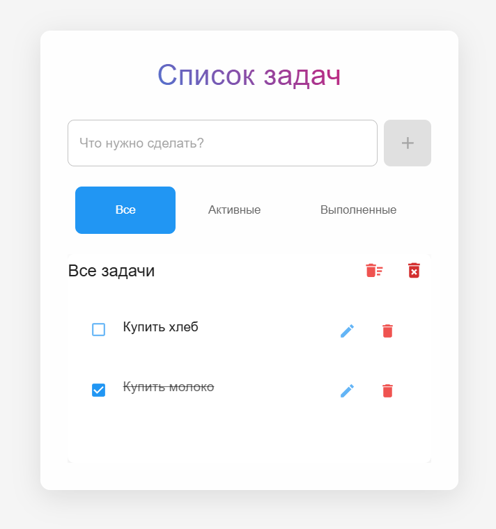

# TodoApp-React.JS (React / TypeScript)

## Обзор 🌟

Современное приложение для управления задачами с адаптивным дизайном. Позволяет создавать, редактировать и отслеживать задачи с удобной фильтрацией. Интерфейс оптимизирован как для десктопных, так и для мобильных устройств.

### [Посмотреть демо 👈](https://subbotinroman.github.io/TodoApp-React.JS/) 



---

## Стек технологий ⚙️


---

## Возможности 🚀

- ✏️ Создание и управление задачами (добавление, редактирование, удаление)
- 🔄 Изменение статуса задач (выполнено / активно)
- 🗑️ Удобное удаление: отдельных задач, всех задач или только выполненных
- 🔍 Фильтрация по статусу (все, активные, выполненные)
- 📱 Адаптивный дизайн с поддержкой мобильных устройств
- ✨ Современный интерфейс с анимациями и эффектами
- ⚡ Удобное управление состоянием через Redux Toolkit

---

## Как запустить локально 💻

1. Клонируйте репозиторий:
```bash
git clone https://github.com/SubbotinRoman/TodoApp-React.JS.git
```

2. Перейдите в папку с проектом:
```bash
cd TodoApp-React.JS
```

3. Установите зависимости и запустите проект:
```bash
npm i && npm run start
```

Приложение будет доступно по адресу: http://localhost:5173
